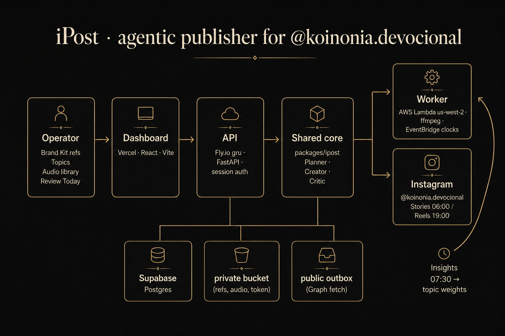
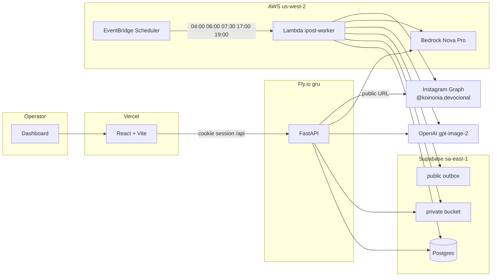
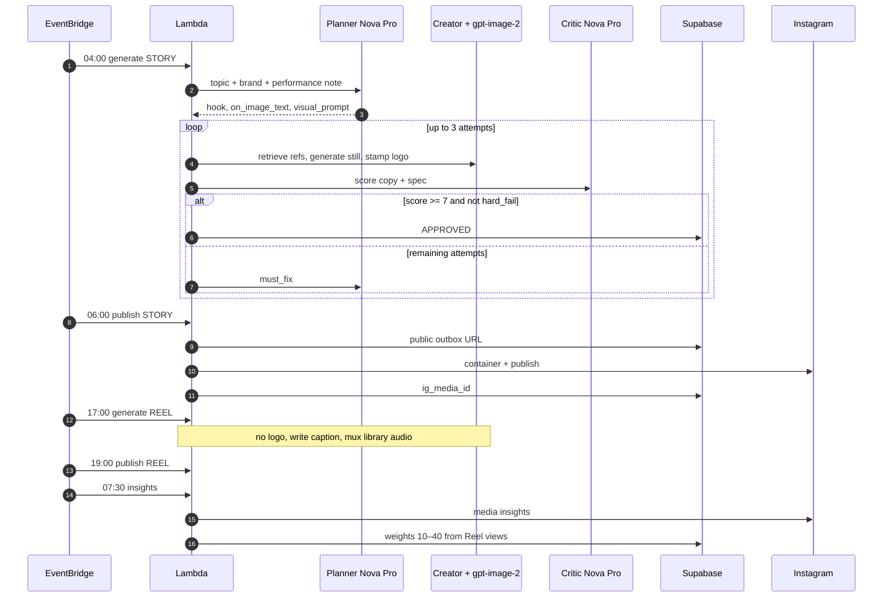
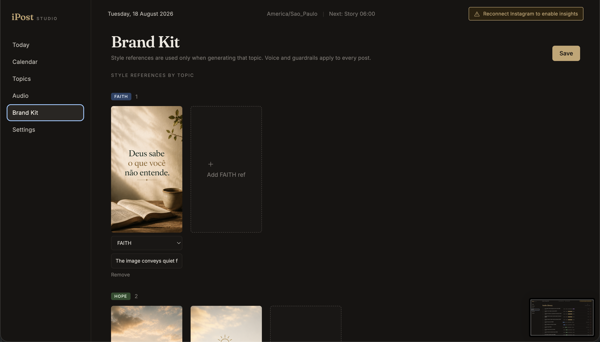
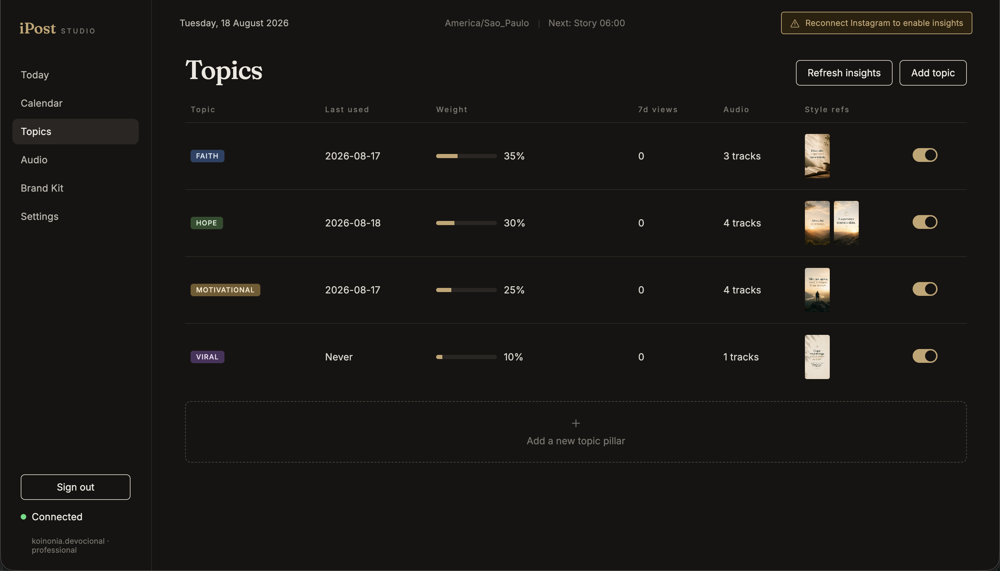
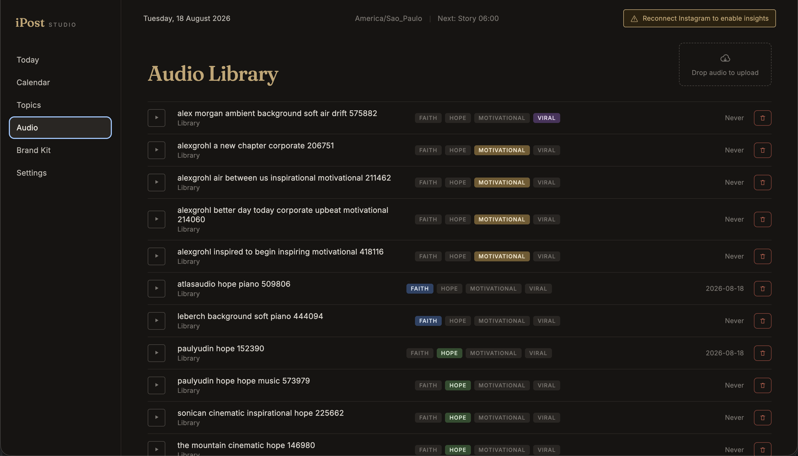
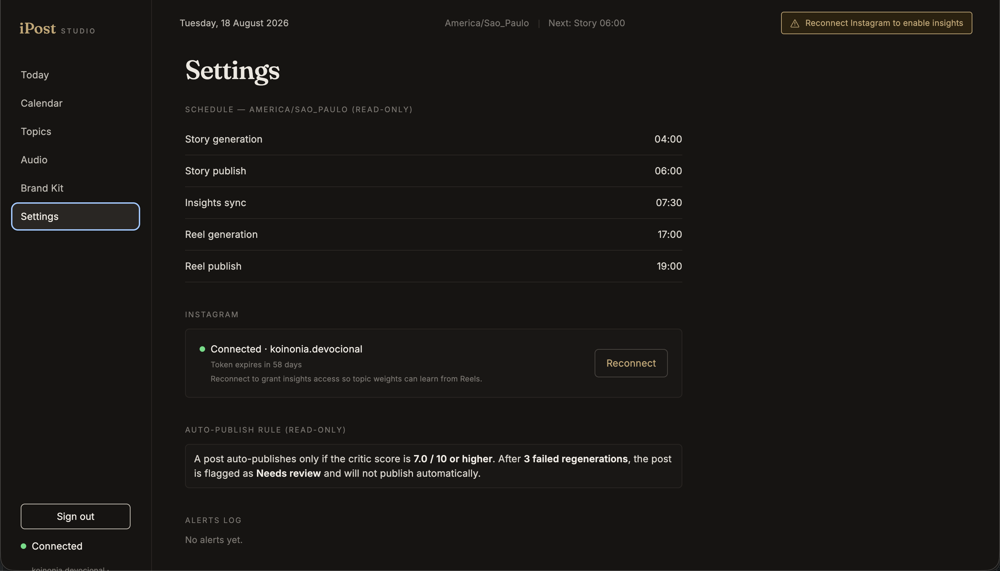
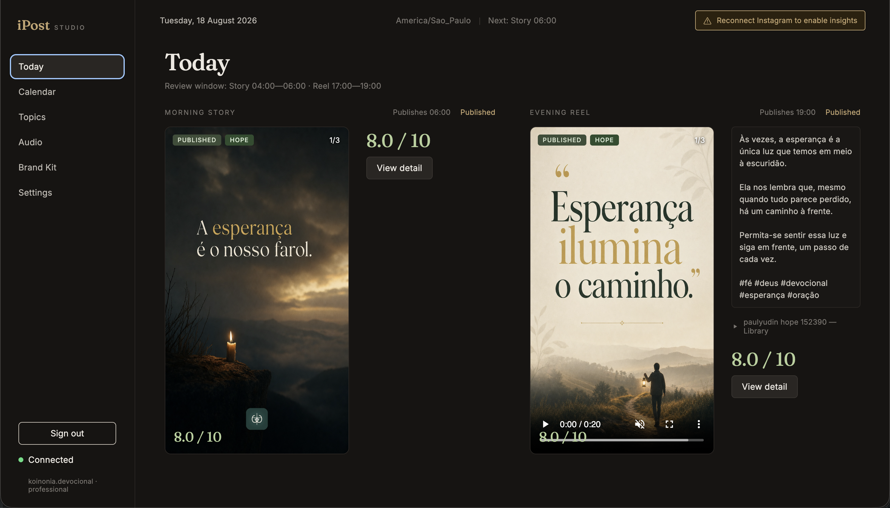
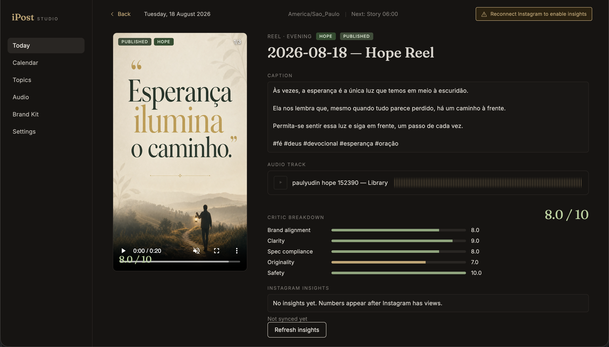
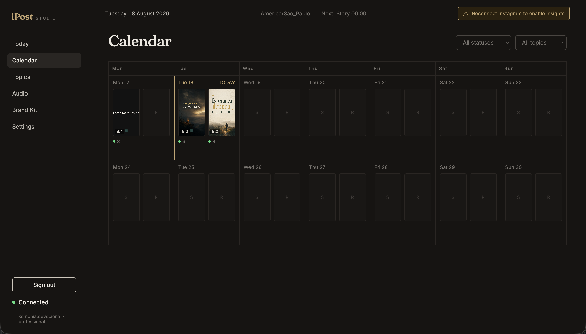

# iPost

A single-operator, agentic Instagram studio for **[@koinonia.devocional](https://www.instagram.com/koinonia.devocional/)**. Built by **Vitor Alves**.

iPost plans, generates, critiques, publishes, and learns from one Story and one Reel every day in **America/Sao_Paulo**. It is not a generic social scheduler. It is the publishing arm of **Koinonia**, the Brazilian Christian devotional app I built and shipped as [Koinonia: Devocional Bíblico](https://apps.apple.com/br/app/koinonia-brasil/id6769403598?l=en-GB) on the App Store and [Koinonia Estudo Bíblico](https://play.google.com/store/apps/details?id=br.com.app.koinonia) on Google Play — [www.koinoniadevocional.com.br](https://www.koinoniadevocional.com.br/).

I run this every day. The dashboard is authenticated. [Get in contact](mailto:vitordgav@gmail.com) to see it running. This README is the walkthrough: architecture, agent loop, operator workflow, screenshots, and the tradeoffs behind the design.



---

## Summary

| Section | What you will find |
| --- | --- |
| [Why this exists](#why-this-exists) | Koinonia, the Instagram voice, why a custom agent instead of Buffer |
| [What ships every day](#what-ships-every-day) | Story vs Reel contract, clocks, quality gate |
| [Repository map](#repository-map) | Monorepo layout |
| [Runtime architecture](#runtime-architecture) | Vercel, Fly.io `gru`, Lambda `us-west-2`, Supabase, why they are split |
| [The agent loop](#the-agent-loop) | Planner → Creator → Critic, tools, regeneration |
| [Closed loop](#closed-loop-insights--weights) | Instagram insights → topic weights → next pick |
| [Operator workflow](#operator-workflow) | Brand refs in, published post out |
| [Dashboard](#dashboard) | Screenshots of every screen |
| [Auth](#authentication) | One admin in Postgres, HTTP-only cookie, what stays public |
| [Data and storage](#data-and-storage) | Tables, private vs public buckets |
| [Tradeoffs](#tradeoffs) | Decisions made |
| [Limits and next](#known-limits-and-what-i-would-build-next) | Honest gaps |
| [Local run](#local-run) | How to boot it if you clone the repo |

---

## Why this exists

Koinonia is a quiet daily ritual: guided meditations by theme, liturgy with audio, an offline Bible, a journal, a widget, verse cards. The Greek *koinonia* means communion. The product promise is depth without a noisy feed — about five minutes with God, no ads.

The Instagram account is the public voice of that product, not a growth hack. Posts must feel like a verse card someone would keep. Brazilian Portuguese first. No prosperity gospel, no hustle Christianity, no “link na bio.”

Off-the-shelf schedulers can post a file at 06:00. They cannot:

- hold a brand kit and refuse banned topics
- pick a topic by recency and learned weight
- write a 3–8 word PT-BR line that is a private thought, not a sermon
- generate a 9:16 still, stamp a logo only on Stories, mux library audio only on Reels
- fail a post that scores under 7.0 and try again
- read Reel views the next morning and tilt tomorrow’s planner

iPost is that system. I operate it every day. Agents do the craft work. I review the morning window and the evening window.

The stack is fullstack and agentic on purpose: a React studio, a FastAPI control plane, a shared Python package, and a typed tool loop (planner → creator → critic) that can run from a button or from a clock. Models sit inside production constraints — ffmpeg, Instagram Graph, a critic gate, and an API that is not left open on the public internet.

---

## What ships every day

Two posts. Same timezone. Different objects.

| | Morning Story | Evening Reel |
| --- | --- | --- |
| Generate | 04:00 | 17:00 |
| Publish | 06:00 | 19:00 |
| Format | 9:16 still | 9:16 still + library audio → MP4 |
| Logo | Koinonia mark stamped at the bottom | No logo — type is the subject |
| Caption | None | PT-BR, sentences on blank lines, then `#fé #deus #devocional #esperança #oração` |
| Audio | None | First unused tagged track, then LRU, then highest plays |
| Instagram object | Story | Reel |

**Quality gate (read-only in Settings):** auto-publish only if the critic score is **≥ 7.0 / 10**. After **3** failed regenerations the job is `NEEDS_REVIEW` and will not publish on the clock. Email goes out via Resend.

**Insights clock:** 07:30. Pulls Graph metrics, stores them on the job, recomputes topic weights from recent Reel views (clamped 10–40).

Generate and publish schedules are Terraform-gated (`scheduler_enabled`). Insights has its own flag. The clocks can stay dark while the product loop is still being proven. That is intentional, not unfinished.

---

## Repository map

```
iPost/
  apps/web/          React 19 + Vite dashboard (Vercel)
  apps/api/          FastAPI process (Fly.io, gru)
  apps/worker/       Lambda container image (ffmpeg + the same package)
  packages/ipost/    Shared Python: agents, Instagram, storage, jobs, auth
  infra/             Terraform: ECR, Lambda, EventBridge Scheduler, IAM
```

`packages/ipost` is the product. The API and the worker are two ways to call it. FastAPI for a human at a browser. Lambda for a cron payload `{ "action": "generate", "type": "STORY" }`. There is one pipeline, one job schema, one brand kit.

Python is a `uv` workspace. The web app is a normal Vite package. Terraform does not own the dashboard or the Fly machine; it owns the long job.

---

## Runtime architecture




### Why three runtimes instead of one box

| Piece | Where | Why |
| --- | --- | --- |
| Dashboard | Vercel | Static React. No Python, no ffmpeg, no secrets in the browser except the API origin. |
| API | Fly.io `ipost` in **gru** | I am in Brazil. Review, upload, and login should feel local. 512 MB is enough for HTTP + a generate I trigger by hand. Machines stop when idle. |
| Worker | Lambda **us-west-2**, 2 GB RAM, 2 GB ephemeral, 900 s, container + ffmpeg | Bedrock is in `us-west-2`. A Reel mux is CPU and disk. Fly’s API VM is the wrong shape for that. EventBridge already speaks Lambda. |
| Data | Supabase Postgres + Storage, project in **sa-east-1** | Config, jobs, and files near the operator and the Fly region. Graph cannot fetch a private object, so publish copies land in a **public** `outbox` bucket. Brand refs, audio, and the Instagram token stay in **private**. |

The shared library does not care who called it. `AWS_LAMBDA_FUNCTION_NAME` or `FLY_APP_NAME` only changes the work directory to `/tmp`.

### Daily sequence



---

## The agent loop

Generation is not “call a model and hope.” It is a typed loop in `packages/ipost/ipost/agents/pipeline.py`.

1. **Pick topic in Python.** Enabled topics only. Prefer never-used, then oldest `last_used`, then highest weight. The model does not choose the pillar. It receives one slug. That keeps the closed loop honest: weights change what ships, not what the LLM feels like today.
2. **Planner (Bedrock Amazon Nova Pro via LiteLLM + OpenAI Agents SDK).** Structured `PlanOutput`: topic, hook, `on_image_text`, `visual_prompt`, caption (Reels only). Instructions are the Koinonia brief: voice, banned lines, what the account is and is not. Style refs are not dumped into the planner; it writes metaphor, not art direction.
3. **Creator (same SDK, tools, same model family for text; stills are OpenAI `gpt-image-2`).** Forced tool order:
   - `retrieve_style_refs` — only refs tagged to this topic
   - `generate_still` — 9:16, type baked into the image
   - `write_caption` — Reels only
   - Logo stamp is Pillow, not a tool, and only for Stories
   - Audio mux is ffmpeg after the still exists, not a model step
4. **Critic (Nova Pro).** Subscores: brand, clarity, spec, originality, safety. Overall score. Optional `must_fix`. `hard_fail` blocks publish even if the number looks fine.
5. **If it fails** and attempts remain: planner runs again with `must_fix`, creator and critic run again. Max 3. Then `NEEDS_REVIEW`.

Hashtags are appended in Python (`apply_reel_hashtags`). The model is not trusted to remember five tags the same way twice.

Mock mode (`IPOST_MOCK_BEDROCK`) exists so the loop can be tested without paying for pixels. It is a development switch, not a production fallback.

---

## Closed loop: insights → weights

Publish persists `ig_media_id`. The 07:30 job (or **Refresh insights** on the dashboard) calls Instagram insights. Stories expire quickly; Reels keep views.

Topic weights are **not** a vibe score from the critic. They are recent Reel view totals, renormalized into **10–40**. LRU still wins on the next pick so a weak pillar is not starved forever. Audio pick is: unused first, then oldest, then highest plays.

OAuth must include `instagram_business_manage_insights`. The Settings banner exists because a token minted before that scope is connected but blind.

---

## Operator workflow

This is the path from “I have a feeling for Hope” to a published Reel.

### 1. Sign in

One admin row in `users`. Password is scrypt-hashed. Login sets an HTTP-only cookie. There is no signup. I insert the operator with `ipost-create-admin`.

### 2. Brand kit — the refs the models are allowed to see

Voice and banned phrases apply to every post. Style refs apply **only** to the topic they are tagged with. A Faith still must not steal a Motivational mountain if I did not attach it there.

Upload goes to `private/brand/refs/{id}.png`. The dashboard serves it through `GET /brand-kit/refs/{id}` (session required) so the browser never holds a service-role key.



Save **upserts**. It does not wipe the table. Removing a card deletes the row and the object. That distinction was learned the hard way and is now a product rule.

### 3. Topics — pillars, not hashtags

Faith, Hope, Motivational, Viral (and any pillar I add). Each has a weight, a last-used date, a 7-day view total, tagged audio count, and thumbnails of its refs. Disable a pillar and the picker skips it.



### 4. Audio library

Reels are a still plus a licensed library track. I drop files, tag them with the same pillars, preview in the table. The worker muxes the pick into a 9:16 MP4. Unused tracks go first so the library actually rotates.



### 5. Connect Instagram

Settings holds the OAuth start. Scopes: `instagram_business_basic`, `instagram_business_content_publish`, `instagram_business_manage_insights`. The long-lived token lives in the private bucket as `instagram_token.json`, not in git.



### 6. Generate

Manual from Today, or Lambda at 04:00 / 17:00 if the generate clock is armed. Same `generate_job()`. The job is written to Postgres as it moves: `GENERATING` → `CRITIQUE` → `REGENERATING` → `APPROVED` or `NEEDS_REVIEW`.

### 7. Review window

Today is two columns: morning Story, evening Reel. Media on the left. Caption, score, and actions on the right. Review windows are 04:00–06:00 and 17:00–19:00. I can open the job, read the critic breakdown, attach a different track, reject, skip, or publish now.





### 8. Publish

Lambda at 06:00 / 19:00, or the button. The still (and Reel MP4) is uploaded to the **public** outbox so Graph can fetch it. Then container create → wait until finished → `media_publish`. `ig_media_id` is stored for the morning after.

Calendar is the week grid: **S** and **R** per day, thumb and score when a job exists.



### 9. Learn

07:30 insights. Weights move. The next unused Hope track is likelier if Hope Reels are carrying the week.

---

## Dashboard

The UI is a dark studio: Fraunces for titles, Inter for data, gold on charcoal. It is a control surface for one account, not a SaaS marketing site.

These shots are the product. [Get in contact](mailto:vitordgav@gmail.com) to see it running.

| Screen | File | Role |
| --- | --- | --- |
| Today | [`screenshots/home.png`](screenshots/home.png) | Daily review of Story + Reel |
| Job detail | [`screenshots/today_details.png`](screenshots/today_details.png) | Caption, audio, critic, insights |
| Calendar | [`screenshots/calendar.png`](screenshots/calendar.png) | Week of S/R slots |
| Topics | [`screenshots/topics.png`](screenshots/topics.png) | Pillars, weights, refs |
| Audio | [`screenshots/audio.png`](screenshots/audio.png) | Library + tags |
| Brand Kit | [`screenshots/brandkit.png`](screenshots/brandkit.png) | Voice, bans, topic refs |
| Settings | [`screenshots/settings.png`](screenshots/settings.png) | Clocks, OAuth, gate |

The web app talks to the API with `credentials: "include"`. In local dev, Vite proxies `/api` to `:8000`. In production, `VITE_API_URL` points at Fly and the session cookie is `Secure` + `SameSite=None`.

---

## Authentication

There is no user-management product. I am the only operator.

- Table `users`: `username`, `password_hash` (scrypt)
- `POST /auth/login` sets `ipost_session` (HMAC payload, 30 days, HTTP-only)
- Every dashboard and mutation route uses `require_admin`
- `GET /health` and `GET /` stay open for Fly
- `GET /auth/instagram/callback` stays open because Meta redirects the browser there; the one-time code is the capability
- Images and audio are `` / `<audio>` tags. They cannot send `Authorization`. A cookie on the API host is why those routes can stay protected without signed query strings

`require_token` on publish/insights is **not** caller auth. It loads the stored Instagram token. Caller auth is the session. Confusing those two is how a personal API gets a public generate button.

---

## Data and storage

**Postgres (service role from the API/worker):**

- `topics`, `tracks`, `track_topics`
- `brand_kit`, `style_refs` (`url` stored as `private:{path}`)
- `jobs` (full `JobRecord` JSON)
- `users`

RLS is on. The app uses the service role because this is a single-tenant operator tool, not a multi-user Supabase app.

**Storage:**

| Bucket | Visibility | Contents |
| --- | --- | --- |
| `private` | private | `brand/refs/*`, audio, `instagram_token.json` |
| `outbox` | public | Stills and MP4s Instagram must download |

If Graph cannot GET the outbox URL in an incognito window, publish will fail. That check is older than the agents and still the first thing to verify.

---

## Tradeoffs

### 1. Split the API and the worker

A single Fly box that also muxes video looks simpler. It couples a cheap always-addressable HTTP process to a 15-minute ffmpeg job and to Bedrock’s region. Splitting them costs a container pipeline and an extra credentials surface. It keeps the dashboard snappy in São Paulo and the heavy job next to the model.

### 2. Nova Pro for language, gpt-image-2 for stills

One vendor would be tidier. Editorial 9:16 type-in-image is the product. I would rather pay OpenAI for the still and Bedrock for planner/critic than force Stability or Nova to be a typographer. The creator agent is explicit: it does not draw the logo and it does not art-direct type in the planner.

### 3. Critic reads copy, not pixels

The critic receives the plan, the caption, and a path. It does not currently vision-score the still. That is a real gap. A vision critic would catch “logo on a Reel” or unreadable type. It would also add latency and another failure mode. The 7.0 gate is a copy/spec gate today.

### 4. Python picks the topic, not the planner

If the model picks the pillar, insights cannot steer the factory. Weights become decoration. The planner still writes the metaphor; it does not get to dodge Viral forever.

### 5. Public outbox, private refs

Instagram’s crawler is not my dashboard user. It needs a world-readable URL. Brand refs and audio never need that. Two buckets. No signed URL gymnastics on publish.

### 6. Clocks are flags

Arming 04:00 generate before I trust brand refs, audio tags, and the critic is how you spam a live church account. Terraform `scheduler_enabled` / `insights_scheduler_enabled` let insights learn while generate/publish stay in my hands.

### 7. Cookie session, not JWT in localStorage, not a user service

One human. Images must load. XSS on a JWT in `localStorage` is a worse fit than an HTTP-only cookie. I do not need Cognito. I do need `SESSION_SECURE=true` on Fly so Vercel can send the cookie cross-site.

### 8. Hashtags and sentence breaks in code

Models drift. Five static tags and caption paragraphing are brand law. They live in `templates.py` and are re-applied on the way out.

### 9. Save must not delete the world

An earlier brand-kit save replaced every `style_refs` row. The files in Storage survived; topic tags did not. Save is upsert-only now. Delete is an explicit button and it deletes the object too. Agent tools that “refresh” config are dangerous when the UI can send a partial list.

### 10. Viral is a topic, not a special case

A five-track minimum for Viral blocked the picker for a pillar I still wanted to use. Eligibility is now “enabled.” If Viral is thin, I disable it. I do not hide it inside `eligible_topics`.

### 11. Service role vs a real multi-tenant design

RLS is enabled so a leaked anon key is not a full dump. The API still uses the service role. That is correct for a single-operator publisher and wrong for a SaaS. I would not copy this tenancy model into a product with customers.

### 12. Making the GitHub repo public

`.env` and `terraform.tfvars` are gitignored and were never committed. The actual blocker was an unauthenticated Fly API whose URL lived in `VITE_API_URL`. Session auth is the fix. A personal email in git is not a secret.

---

## Known limits and what I would build next

- **Critic has no eyes.** Next: a vision pass on the still before the score is final.
- **Instagram token refresh** is not on a daily schedule. The Settings banner is the backstop (long-lived tokens ~60 days).
- **Generate/publish clocks** stay off until I am ready to trust an unattended morning.
- **No multi-account, no roles, no audit log** of who published. There is one who.
- **Worker and API can drift** if I deploy one image and forget Fly. They share a package; they do not share a release train yet.
- **Insights are Reel-weighted.** Stories die in 24 hours; they should not drive pillar mix.

This is how I build agentic systems I have to live with: production constraints first, models inside a typed loop, a human on the clock that can hurt a real audience.

---

## Local run

You need ffmpeg, a Supabase project, a Meta Instagram app (Instagram App ID, not the Facebook app ID), and the env in `.env.example`.

```bash
brew install ffmpeg
cp .env.example .env
# fill secrets; set SESSION_SECRET; SESSION_SECURE=false locally
uv sync --package ipost-api
uv run python -m ipost.migrate
uv run python -m ipost.create_admin --username admin --password '…'
uv run --package ipost-api ipost-api
```

Dashboard:

```bash
cd apps/web
npm install
npm run dev
```

Vite is `http://localhost:5173` and proxies `/api` to `http://localhost:8000`.

Worker image (only if you are deploying clocks):

```bash
uv run python apps/worker/package_docker.py --tag <tag> --push <ecr>
# then set image_uri in terraform.tfvars and apply
```

Do not commit `.env` or `infra/terraform.tfvars`.

Meta setup notes (Development mode is enough for testers): use [developers.facebook.com/apps](https://developers.facebook.com/apps/), app type **Business**, Instagram product **API setup with Instagram login**, redirect URI exactly `http://localhost:8000/auth/instagram/callback` (watch for a trailing slash the dashboard likes to add). Copy the **Instagram** App ID and secret, not the Meta app ID at the top of the dashboard.

---

## Stack

| Layer | Choice |
| --- | --- |
| Dashboard | React 19, Vite 8, TypeScript, React Router 7 |
| API | FastAPI, Uvicorn, Fly.io `gru` |
| Worker | AWS Lambda container, ffmpeg, EventBridge Scheduler, `us-west-2` |
| Agents | OpenAI Agents SDK, LiteLLM, Bedrock Nova Pro, OpenAI gpt-image-2 |
| Data | Supabase Postgres + Storage (`sa-east-1`) |
| Publish | Instagram Graph API (login, content publish, insights) |
| Infra | Terraform, ECR |
| Auth | scrypt password, HMAC session cookie |
| Alerts | Resend |

---

Koinonia is the product people pray with. iPost is the factory that speaks for it in public, once at dawn and once at dusk, in a voice I can defend.
